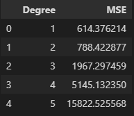
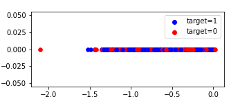
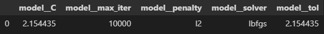
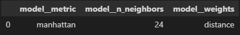
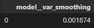
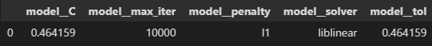
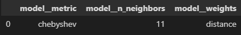

\pagebreak

# Table of Contents

* [Preprocessing](#preprocessing)
    * [Datetime Analysis](#datetime-analysis)
    * [Filling NaNs](#imputation-of-var4)
    * [Encoding and Scaling](#encoding-and-scaling)
        * [Encoding](#encoding)
        * [Scaling](#scaling)
        * [Implementation](#implementation-details)
    * [PCA Analysis](#pca-plots)
        * [1D PCA](#1d-pca)
        * [2D, 3D PCA](#2d-3d-pca)
        * [Conclusion](#pca-conclusion)
    * [Conclusion](#preprocessing-conclusion)
* [Training](#training)
    * [Raw Models](#evaluation-of-raw-models)
        * [Logistic Regression](#raw-logistic-regression)
        * [KNN](#raw-knn)
        * [Naive Bayes](#raw-naive-bayes)
    * [Hyperparameter Tuning](#hyperparameter-tuning)
        * [Logistic Regression](#logistic-regression)
        * [KNN](#knn)
        * [Naive Bayes](#naive-bayes)
        * [Hightlight](#highlight)
    * [PCA + Tuning](#pca--hyperparameter-tuning)
        * [Logistic Regression](#logistic-regression-1)
        * [KNN](#knn-1)
        * [Naive Bayes](#naive-bayes-1)
    * [Conclusion](#conclusion)
* [References](#references)

\pagebreak

# Preprocessing

## Datetime analysis

While it was simpler to omit the column ```var7```, I have decided to include it to the learning. Steps I have performed to include it in the model:

1. Convert the ```string``` to the ```datetime```
2. Drop anomalies (i.e. 29th of February)
3. Split the ```datetime``` onto several categories
    1. Year (has zero variance $\Rightarrow$ dropped)
    2. Month
    3. Day
    4. Time (total time within a day in seconds) 

While regression of the ```var4``` did not show much of an improvement with these extra features, I noticed that the PCA performance was significantly improved and the data plots were much more evident. Moreover, performance of the models was slightly affected as well. As a result, I have decided keep these features.

## Imputation of ```var4```

To fill the missing values of ```var4``` I have decided to run ```PolynomialRegression``` with several different degrees to compare their efficiency. 

Since our dataset is relatively small, I have decided to omit splitting the data onto the train and test and simply run cross-validation on the regressor with the whole dataset.

To encode the city names I have decided to use ```OrdinalEncoder```. The reason for that is relatively slow performance of ```PolynomialRegression``` with high degrees on the dataset with $300$ columns. Therefore, I have decided to simplify encoder, but keep this feature in the dataset. Tests shown that it did not affect output result in the bad way, but improved overall performance.

To encode ```var6``` I have decided to use ```OneHotEncoder``` since we do not know the relation between *yes* and *no* in our dataset.

Complete pipeline is as follows:

1. Encode `var3`
2. Encode `var6`
3. Scale all other columns
4. Run `PolynomialFeatures` transformer
5. Use `LinearRegression` as a regressor
6. Pack everything into the `Pipeline`
7. Run crossvalidation with KFold coefficient = 3 (as requested in problem statement)

Results of the test can be seen in the table below:



As we can see from the results of the test, `LinearRegression` regressor is the best candidate for augmenting missing data. As a result, I will use this method and show further that it was a good decision which leads to a decent learning outcome.

## Encoding and Scaling

### Encoding

Further on I will encode both ```var3``` and ```var6``` using `OneHotEncoder`, since neither countries, nor *yes/no* do not have ordinal relation. Moreover, I have tried using `OrdinalEncoder` and it did not show positive evolution of scores.

To keep the system as simple as possible, I have decided to skip the testing of various different encoders, since `OneHotEncoder` successfully saves all necessary relations, has a good performance and we will see on graphs that PCA  with such features still performs very good.

### Scaling

As a scaler I will use `StandardScaler`. Since we are planning to implement some PCA techniques, it is important that our data is normalized and has zero mean. It is exactly what this scaler does.

### Implementation details

I will not apply neither encoders, nor scalers to the dataset or create new datasets. My work will completely rely on the [`ColumnTransformer`](https://scikit-learn.org/stable/modules/generated/sklearn.compose.ColumnTransformer.html) and [`Pipeline`](https://scikit-learn.org/stable/modules/generated/sklearn.pipeline.Pipeline.html?highlight=pipeline#sklearn.pipeline.Pipeline).

As a result, my initial dataset stays unchanged after any manipulation and I get all the necessary tests and runs sequentially.

Example code is as following:

```python
column_transformer = ColumnTransformer([
    ('ohe_encoder', OneHotEncoder(), 
    ['var3', 'var6']),
    ('standard_scaler', StandardScaler(), 
    ['var1', 'var2', 'var4', 'var5', 'time'])
], remainder='passthrough')

pipeline = Pipeline([
        ('column_transformer', column_transformer),
        ('pca', myPCA()),
        ('model', model)
])
```

## PCA Plots

Let's first analyze the PCA results dimension after dimension. 

### 1D PCA

The following plot is the plot of PCA with number of dimensions equal to 1. As we can see, data is almost undistinguishable on the graph and highly coincides.



### 2D, 3D PCA

Now let's analyze 2D and 3D PCAs. 

2D PCA is enough to see the pattern of distribution of the target. Upper half of the plot is the ```target=0``` with some anomalies, while the bottom part is ```target=1```.

3D PCA is even more demonstrative. With little to none anomalies it is easy to see how data is aranged in the space considering the color as the category.


### PCA Conclusion

Plots above are enough to understand that we correctly found the relations between the features and reduced the dimensionality. Moreover, result of the polynomial regression imputter was enough not to break the relations between ```target``` and ```features```. Further on, different classification techniques can be implemented to make a use of such evident dimensionality reduction.

## Preprocessing Conclusion

As we can see, it was quite difficult to predict `var4`. The reason for that is the independence of the predictors. Anything with the degree higher than 1 immidiately started overfitting and giving wrong results. This implies that `var4` is independent and the best regressor we can choose is `LinearRegression`.

\pagebreak

# Training

I will make training in three consecutive steps.

1. Evaluation of **raw** models
2. Hyperparameter tuning of raw models
3. PCA + hyperparameter tuning

## Evaluation of raw models

I will test and tune the following models:

* LogisticRegression
* KNN
* Naive Bayes

I will arbitrary choose hyperparameters or leave them default if possible to create a very raw estimation of accuracy and preprocessing quality.

### Raw Logistic Regression

```Logistic Regression``` shown the best raw result with almost $97.3\%$ of accuracy.

$$accuracy=0.9728260869565217$$

$$precision=0.9550561797752809$$

$$recall=0.9883720930232558$$

### Raw KNN

KNN shown a decent result, which shows the efficiency of such metric on our dataset.

$$accuracy=0.9456521739130435$$

$$precision=1.0$$

$$recall=0.8837209302325582$$

### Raw Naive Bayes

```GaussianNB``` model shown the worst raw result with accuracy close to simple guessing.

$$accuracy=0.5163043478260869$$

$$precision=0.48717948717948717$$

$$recall=0.6627906976744186$$

## Hyperparameter Tuning

For hyperparameter tuning I will use ```GridSearchCV``` with ```cv=3, scoring='accuracy'``` and specific parameter grids for each model.

### Logistic Regression

Tuning ```solver, C``` - inverse regularization strength, ```tolerance``` and ```penalty``` algorithm I was able to reach the following score:

$$accuracy=0.9728260869565217$$

$$precision=0.9550561797752809$$

$$recall=0.9883720930232558$$

The best parameters configuration is as follows:



### KNN

Tuning ```n_neighbors```, ```metric``` algorithm and ```weights``` I was able to reach the following score:

$$accuracy=0.9510869565217391$$

$$precision=0.9873417721518988$$

$$recall=0.9069767441860465$$

The best parameters configuration is as follows:



### Naive Bayes

The only hyperparameter tuned was ```var_smoothing``` and the result of tuning is as follows:

0.9728260869565217, precision: 0.9764705882352941, recall: 0.9651162790697675

$$accuracy=0.9728260869565217$$

$$precision=0.9764705882352941$$

$$recall=0.9651162790697675$$

The best parameters configuration is as follows:



### Highlight

Grid Search of the best parameters with cross validation successfully improved the scores of all the models. Moreover, Naive Bayes accuracy score is $0.9728$ which means that most probably I will be unable to beat this result with other techniques. Even though there might be some advanced preprocessing or testing technique to improve the score, it is very unlikely they will show a significant improvement.

## PCA + Hyperparameter Tuning

During the hyperparameter tuning I used the same parameter grids as during the previous step.

I will use custom made ```PCA(n_components=3)``` as dimensionality reductor.

### Logistic Regression

Logistic Regression shows a significant change in the score. However, the performance degraded. As a result, The best score I have achieved was:

$$accuracy=0.8369565217391305$$

$$precision=0.8414634146341463$$

$$recall=0.8023255813953488$$

The best parameters configuration is as follows:



### KNN

As well as on LR, performance has significantly degraded. Results are as following:

$$accuracy=0.7934782608695652$$

$$precision=0.8076923076923077$$

$$recall=0.7325581395348837$$

The best parameters configuration is as follows:



### Naive Bayes

NB performance has degraded as well. Results are as following:

$$accuracy=0.8043478260869565$$

$$precision=0.7976190476190477$$

$$recall=0.7790697674418605$$

The best parameters configuration is as follows:


## Conclusion

Various experiments shown that the main effect on the result was the different way of imputting the ```var4``` column. While it was possible to improve overall performance of PCA + GSCV via tuning the imputter, it was obvious that such a method is unable to give result better, than the **Naive Bayes** with GridSearch on the dataset. 

One of the possible reasons of the bad performance of the models on the PCA is the features independence. Reducing number of independent features each of which had an impact on the overall decision could dramatically affect the performance. Moreover, results of **Naive Bayes** model agree with this assumption.

Since **Naive Bayes** outperformed other methods of a classification, we can conclude that our features are relatively independent. We can prove that it is true, since dropping various features during regressing `var4` does not significantly affect the result of the prediction. However, dropping the `var4` column indeed does.

Moreover, it is relatively difficult to predict `var4` with the small error, which again proves that `var4` is indeed independent. It seems that our features and independent predictors of the target such as *spam/not spam* and others and as a result, `Naive Bayes` has a good performance.

It seems that datetime information was relatively redundant. While it helped to improve the performance of the `PCA`, it did not significantly affect the performance of models on the whole dataset. As a result, we could probably completely omit this data in the sake of simplicity.

\pagebreak

# References

## PCA Implementation

```python
"""
This is my implementation of the PCA algorithm.
It is designed to implement fit and transform
methods to become compatible with pipelines
and other components of ML.
"""
class myPCA:
    
    transformer = None # transformer of inputs
    n_components = 0   # number of dimensions

    def __init__(self, n_components=3):
        self.n_components = n_components

    # Construct the transformer
    def fit(self, X, y = None):
        scaled = StandardScaler().fit_transform(X)
        covMatrix = pd.DataFrame(scaled).cov()
        w, v = np.linalg.eig(covMatrix)
        wv = list(zip(w, v))

        def complex_key(elem):
            return elem[0]

        # Sort eigenvalues
        wv.sort(reverse=True, key=complex_key)

        # Compose a transformer from n_components largest eigvals
        self.transformer = np.array([v[1][:, np.newaxis] 
                            for v in wv[0:self.n_components]])
        return self

    # Apply the transformer to the input
    def transform(self, X):
        result = np.dot(X, self.transformer)
        result = result.reshape((result.shape[0], result.shape[1]))
        result = [[result[i][j].real for j in range(result.shape[1])] 
                for i in range(result.shape[0])]
        result = np.array(result, dtype=np.float64)
        return result
```

\pagebreak

## Links

- [`ColumnTransformer`](https://scikit-learn.org/stable/modules/generated/sklearn.compose.ColumnTransformer.html)
- [`Pipeline`](https://scikit-learn.org/stable/modules/generated/sklearn.pipeline.Pipeline.html?highlight=pipeline#sklearn.pipeline.Pipeline)

## Informational resources

- Introduction to ML Labs 1-5
- Introduction to ML Lectures 1-5